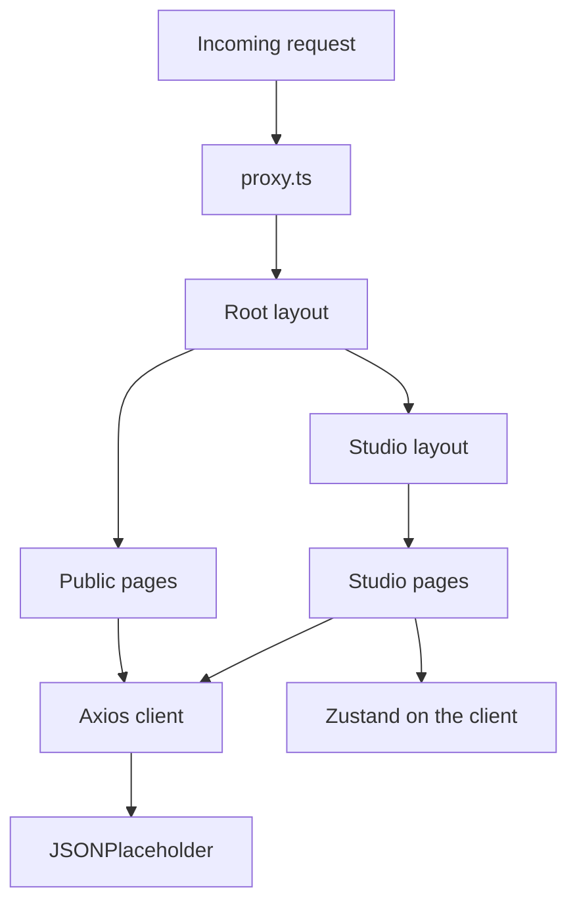

# Content platform

A small Next.js App Router app for browsing articles, authors, and comments from [JSONPlaceholder](https://jsonplaceholder.typicode.com/). The surface is intentionally limited. The work is in architecture: route groups, a server/client split, edge plus server auth, and feature modules that stay out of route files.

## Features

- Public feed with URL-driven search, pagination, author filter, and page size
- Article detail with streamed comments
- Author profiles
- Demo sign-in and a protected Studio (own articles and bookmarks)

## Setup

**Prerequisites:** Node 20+ and [pnpm](https://pnpm.io/) 10 (`packageManager` is `pnpm@10.32.1`).

```bash
cp .env.example .env.local
pnpm install
pnpm dev
```

Open [http://localhost:3000](http://localhost:3000). `pnpm install` also runs `prepare`, which installs Husky hooks.

| Variable | Purpose |
| --- | --- |
| `NEXT_PUBLIC_API_BASE_URL` | JSONPlaceholder origin (required by the Axios client) |
| `AUTH_SECRET` | HMAC key for the session cookie (use a long random string locally) |

**Demo login:** `Sincere@april.biz` / `demo`. Any JSONPlaceholder user email works with password `demo`.

### Scripts

| Script | Command |
| --- | --- |
| `pnpm dev` | Development server |
| `pnpm build` | Production build |
| `pnpm start` | Serve the production build |
| `pnpm lint` | ESLint |
| `pnpm typecheck` | `tsc --noEmit` |
| `pnpm format` | Prettier write |

### Git conventions

Do not commit on `main` or `dev`. The first line of a commit message must start with one of:

`feat:`, `fix:`, `chore:`, `docs:`, `refactor:`, `style:`

The `commit-msg` and `pre-commit` hooks enforce this. See [Git hooks](#git-hooks) below.

## Architecture

Route files stay thin. Domain logic lives in feature folders at the repo root.

```
app/            App Router: route groups, layouts, loading/error, API handlers
articles/       Article types, queries, feed URL helpers, list/feed/comment UI
authors/        Author types and fetches
bookmarks/      Zustand store, bookmark button, bookmark list
auth/           Session types, cookie crypto, login form, client store
lib/            Axios client, routes, Query client
components/     Shared shells, header, studio nav, shadcn primitives
proxy.ts        Edge route protection (Next.js 16 equivalent of middleware)
```

**Route groups** `(public)`, `(auth)`, and `(studio)` (with nested `(feed)` and `(home)`) organize code. They do not appear in URLs: `/`, `/login`, `/studio`, `/studio/bookmarks`.

**Server vs client.** Pages and layouts are Server Components. `"use client"` is limited to interactive islands: header, login form, feed search/list, bookmark button, providers, and error boundaries.



Zustand never holds server data. It mirrors the signed-in session for header/bookmark UI, and persists per-author bookmarks in `localStorage`.

## Technology choices

| Choice | Why |
| --- | --- |
| **Next.js 16 App Router** | RSC-first pages, segment `loading.tsx` / `error.tsx` / `not-found.tsx`, `generateMetadata`, Suspense streaming. Next 16 uses [`proxy.ts`](proxy.ts) instead of `middleware.ts` for the same edge intercept. |
| **TypeScript (strict)** | Domain types (`Article`, `Author`) are mapped from API types (`Post`, `User`). Imports use `@/*`. |
| **Tailwind v4 + shadcn (New York)** | Tokenized theme in [`app/globals.css`](app/globals.css). Radix primitives, not a custom CSS framework. |
| **Zustand** | Client session mirror and persisted bookmarks. Server state stays in TanStack Query or RSC fetches — not duplicated in a global store. |
| **TanStack Query** | Feed SSR prefetch + `HydrationBoundary`, client cache for pagination, `useQueries` on bookmarks. Other pages use RSC `async` fetches when the UI does not need a client cache. |
| **Axios** | One client in [`lib/api/client.ts`](lib/api/client.ts), configured with `NEXT_PUBLIC_API_BASE_URL`. |

Also in the stack: Zod for login validation, HMAC-signed cookies (not JWT), ESLint 9, Prettier with Tailwind class sorting, and the Husky hooks below.

## Key implementation details

### Route protection

Defense in depth, not a single cookie check.

1. **Edge** — [`proxy.ts`](proxy.ts) runs on `/studio/:path*` and `/login`. No session cookie on Studio redirects to `/login` and stashes the intended path in an `auth-from` cookie. A session cookie on `/login` redirects to `/studio`.
2. **Server** — [`app/(studio)/layout.tsx`](app/(studio)/layout.tsx) calls `getSession()` and `redirect`s if verification fails. Cookie *presence* at the edge is not treated as a verified session.
3. **Redirects** — `isStudioPath` validates `auth-from` so it cannot become an open redirect.

### Auth

Demo credentials are checked against JSONPlaceholder `/users` (email match, password `demo`). The session is an HMAC-SHA256 signed cookie (`authorId:name`), `httpOnly`, `sameSite: lax` — see [`auth/cookie.ts`](auth/cookie.ts). The client Zustand store is a hydration mirror via `GET /api/session`.

### Data layer

JSONPlaceholder names (`Post`, `User`) never leak into UI. Mappers live in [`articles/queries.ts`](articles/queries.ts) and [`authors/queries.ts`](authors/queries.ts), matching the glossary in [`CONTEXT.md`](CONTEXT.md).

The feed URL is the source of truth (`q`, `page`, `author`, `pageSize`). Pagination uses `_page` / `_limit`. Search is in-memory because JSONPlaceholder has no search endpoint.

Article comments stream behind `Suspense`. `React.cache()` dedupes article and author fetches within a request.

### Loading and errors

Segment `loading.tsx` and `error.tsx` cover feed, article, author, login, Studio, and bookmarks, plus [`app/global-error.tsx`](app/global-error.tsx) and [`app/not-found.tsx`](app/not-found.tsx). Shared UI: [`components/route-loading.tsx`](components/route-loading.tsx), [`components/route-error.tsx`](components/route-error.tsx).

### Bookmarks

Client-only. Zustand `persist` writes to `localStorage`, keyed by `authorId`. There is no fake backend for a device-local list.

### Git hooks

[`.husky/check-commit.sh`](.husky/check-commit.sh) is the shared guard. Three hooks wrap it:

| Hook | What it does |
| --- | --- |
| `pre-commit` | Refuse commits on `main` / `dev`, then `lint-staged` |
| `commit-msg` | First line must match `feat:`, `fix:`, `chore:`, `docs:`, `refactor:`, or `style:` |
| `pre-push` | `pnpm lint` then `pnpm typecheck` |

`lint-staged` runs Prettier write plus `eslint --fix --max-warnings=0` on JS/TS, and Prettier on `json` / `css` / `md`. Broken types and lint errors should not leave the machine.
